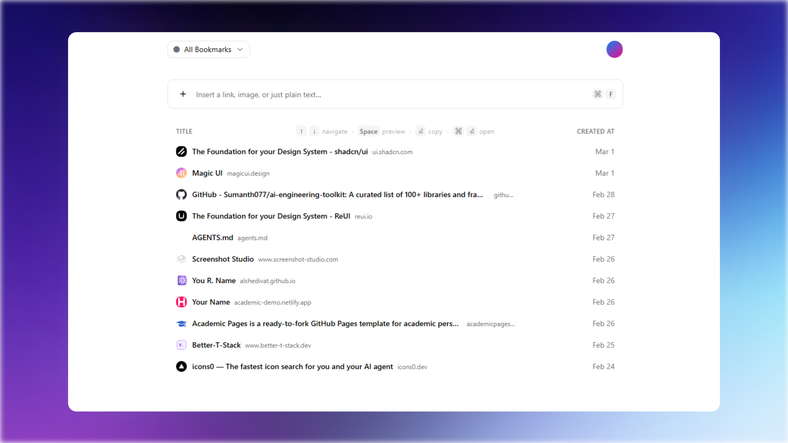

# LinkArena

[](https://nextjs.org/)
[](https://react.dev/)
[](https://www.typescriptlang.org/)
[](https://www.postgresql.org/)
[](https://www.prisma.io/)
[](https://tailwindcss.com/)
[](https://nodejs.org/)
[](.)

A full-stack bookmarking platform with two clients:
- **Web app** (Next.js) for full bookmark management, organization, settings, and account flows
- **Chrome extension** for fast capture, lightweight browsing, and token-auth sync

This README documents the whole application. Extension-specific implementation details are in [extension/README.md](extension/README.md).



---

## Core capabilities

- Save links and notes
- Auto-unfurl metadata (title, description, favicon, preview image)
- Group bookmarks with color, ordering, and move flows
- Search, filtering, and timeline views
- Edit, refresh metadata, and delete bookmarks
- Export bookmarks as JSON
- API token generation and revocation for extension/integrations
- Realtime sync across active clients
- AI auto-grouping for uncategorized bookmarks with optional backfill
- Account auth, password reset, theme settings, and account deletion
- Admin dashboard with user/bookmark activity stats

---

## Architecture

### Web platform
- **Next.js 16** App Router (`app/`)
- **Server Actions** for bookmark/group/account operations (`app/actions/`)
- **Route Handlers** for session and bearer-token APIs (`app/api/`)
- **NextAuth** credentials auth for web sessions
- **Settings + AI categorization** for user-controlled auto-grouping
- **TanStack Query** for client caching/invalidation

### Data layer
- **PostgreSQL** via Prisma (`prisma/schema.prisma`)
- **Entities:** `User`, `Bookmark`, `Group`, `ApiToken`, `PasswordResetToken`
- **User preferences:** `autoGroupEnabled` for AI categorization

### Realtime model
- **SSE Endpoint:** `GET /api/realtime/bookmarks`
- Web app subscribes and invalidates local query caches on events
- Extension background worker subscribes and rebroadcasts updates to popup

### Extension client
- **Manifest V3** app in `extension/`
- Background worker is source-of-truth for token, cache, progressive sync, and realtime
- Popup and sidepanel are thin UIs over runtime messaging

---

## Tech stack

| Category | Technology |
|----------|------------|
| Framework | Next.js 16 |
| UI Library | React 19 |
| Language | TypeScript |
| Database | PostgreSQL + Prisma |
| Auth | NextAuth |
| Styling | Tailwind CSS 4 + shadcn/ui-style components |
| AI Categorization | AI SDK + OpenRouter |
| Email | Resend |
| Extension Build | Vite + CRXJS |

---

## Project structure

```
app/                    Next.js routes, actions, APIs
components/             Web UI components  
lib/                    Shared utilities (auth, realtime, metadata, prisma)
prisma/                 Prisma schema and migrations
public/                 Static assets
extension/              Chrome extension project
```

---

## Getting started

### Prerequisites

- Node.js 20+
- PostgreSQL

### 1. Install Dependencies

```bash
npm install
```

### 2. Configure Environment

```bash
cp .env.example .env.local
```

**Required:**
- `DATABASE_URL`
- `AUTH_SECRET`

**Optional:**
- `NEXTAUTH_URL`
- `NEXT_PUBLIC_APP_URL`
- `RESEND_API_KEY`
- `RESEND_FROM_EMAIL`
- `OPENROUTER_API_KEY`
- `ADMIN_EMAIL`

### 3. Run Migrations

```bash
npx prisma migrate dev
```

### 4. Start Development Server

```bash
npm run dev
```

Open **http://localhost:3000**.

---

## Available scripts

| Command | Description |
|---------|-------------|
| `npm run dev` | Run web app in development mode |
| `npm run build` | Build web app for production |
| `npm run start` | Start production server |
| `npm run lint` | Lint repository |

---

## API reference

### Extension / integration endpoints

| Method | Endpoint | Description |
|--------|----------|-------------|
| `GET` | `/api/sync` | Sync all bookmarks |
| `GET` | `/api/export` | Export bookmarks |
| `GET` | `/api/categories` | List all groups |
| `GET` | `/api/settings` | Read user settings |
| `PATCH` | `/api/settings` | Update user settings |
| `POST` | `/api/bookmarks` | Create bookmark |
| `PUT` | `/api/bookmarks` | Update bookmark |
| `DELETE` | `/api/bookmarks` | Delete bookmark |
| `DELETE` | `/api/bookmarks/:id` | Delete by ID |
| `PUT` | `/api/bookmarks/:id/category` | Update category |
| `GET` | `/api/realtime/bookmarks` | Realtime SSE stream |

### Authentication

```bash
Authorization: Bearer <api-token>
```

---

## Chrome extension

### Quick start

```bash
cd extension
npm install
npm run dev
```

### Load Extension

1. Open `chrome://extensions`
2. Enable **Developer mode**
3. Click **Load unpacked**
4. Select the `extension/dist` folder

For full extension docs (permissions, messaging contract, cache strategy, release zip), see:
- [extension/README.md](extension/README.md)

---

## Production build

### Web app

```bash
npm run build
```

### Chrome extension

```bash
cd extension
npm run build
```

Zip artifact is generated in `extension/release/`.

---

## Operational notes

- API tokens are persisted in extension `chrome.storage.local`
- Token validity is controlled server-side (revoke/regenerate from web app)
- Extension initial sync is paginated, then progressively hydrates remaining bookmarks in the background
- Realtime and progressive sync keep clients aligned with minimal refresh latency
- AI auto-grouping is optional and only runs when configured and enabled

---

## Troubleshooting

### Build fails with `spawn EPERM` (Windows/sandboxed env)
Usually an execution-environment permission issue rather than app code. Retry in a normal local terminal with required permissions.

### PowerShell blocks npm scripts
```bash
cmd /c npm run build
```

### Extension not updating in realtime
- Verify API base URL and token
- Confirm `/api/realtime/bookmarks` is reachable
- Ensure CORS allows `chrome-extension://` origins

---

## License

Private
