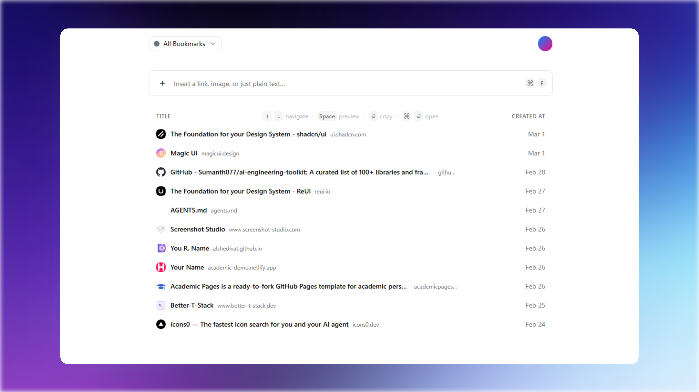

# LinkArena

[](https://nextjs.org/)
[](https://react.dev/)
[](https://www.typescriptlang.org/)
[](https://www.postgresql.org/)
[](https://orm.drizzle.team/)
[](https://tailwindcss.com/)
[](https://nodejs.org/)
[](.)

A full-stack bookmarking platform with two clients:
- **Web app** (Next.js) for full bookmark management, organization, settings, and account flows
- **Chrome extension** for fast capture, lightweight browsing, and token-auth sync

This README documents the whole application. Extension-specific implementation details are in [extension/README.md](extension/README.md).



---

## System overview

| Layer | Description |
|-------|-------------|
| **Clients** | Next.js web app (dashboard, timeline, sign-in/up, admin) and Chrome extension (popup + background worker). |
| **Auth** | NextAuth credentials for web; API tokens (Bearer) for extension and integrations. Tokens hashed in DB. |
| **API** | App Router route handlers under `app/api/`: bookmarks, groups, categories, sync, export, realtime SSE, settings, NextAuth. Session or Bearer auth per route. |
| **Server logic** | Server Actions in `app/actions/` for mutations; shared lib (auth, Drizzle, realtime, app config, metadata). |
| **Data** | PostgreSQL via Drizzle ORM. Models: `User`, `Bookmark`, `Group`, `ApiToken`, `PasswordResetToken`, `AppConfig`. |
| **Realtime** | SSE at `GET /api/realtime/bookmarks`; web app and extension subscribe for live bookmark/group updates. |
| **AI** | [Vercel AI SDK](https://sdk.vercel.ai/) with OpenRouter for optional auto-grouping of uncategorized bookmarks. |
| **Email** | Resend for password reset. Optional admin and public-signup control via `AppConfig`. |

---

## Core capabilities

- Save links and notes
- Auto-unfurl metadata (title, description, favicon, preview image)
- Group bookmarks with color, ordering, and move flows
- Search, filtering, and timeline views
- Edit, refresh metadata, and delete bookmarks
- Export bookmarks as JSON
- API token generation and revocation for extension/integrations
- Realtime sync across active clients
- AI auto-grouping for uncategorized bookmarks with optional backfill
- Account auth, password reset, theme settings, and account deletion
- Admin dashboard with user/bookmark activity stats

---

## Architecture

### Web platform
- **Next.js 16** App Router (`app/`)
- **Server Actions** for bookmark/group/account operations (`app/actions/`)
- **Route Handlers** for session and bearer-token APIs (`app/api/`)
- **NextAuth** credentials auth for web sessions
- **Settings + AI categorization** for user-controlled auto-grouping
- **TanStack Query** for client caching/invalidation

### Data layer
- **PostgreSQL** via Drizzle ORM (`db/schema.ts`)
- **Entities:** `User`, `Bookmark`, `Group`, `ApiToken`, `PasswordResetToken`, `AppConfig`
- **User preferences:** `autoGroupEnabled` for AI categorization; `AppConfig.publicSignupEnabled` for signup gating
- **Migrations** managed by `drizzle-kit` in `drizzle/`

### Realtime model
- **SSE Endpoint:** `GET /api/realtime/bookmarks`
- Web app subscribes and invalidates local query caches on events
- Extension background worker subscribes and rebroadcasts updates to popup

### Extension client
- **Manifest V3** app in `extension/`
- Background worker is source-of-truth for token, cache, progressive sync, and realtime
- Popup and sidepanel are thin UIs over runtime messaging

---

## Tech stack

| Category | Technology |
|----------|------------|
| Framework | Next.js 16 |
| UI Library | React 19 |
| Language | TypeScript |
| Database | PostgreSQL + Drizzle ORM |
| Auth | NextAuth |
| Styling | Tailwind CSS 4 + shadcn/ui-style components |
| AI Categorization | [Vercel AI SDK](https://sdk.vercel.ai/) + OpenRouter |
| Email | Resend |
| Extension Build | Vite + CRXJS |

---

## Project structure

```
app/                    Next.js routes, actions, APIs
components/             Web UI components
db/                     Drizzle schema (schema.ts)
drizzle/                Migration files managed by drizzle-kit
lib/                    Shared utilities (auth, db, realtime, metadata)
public/                 Static assets
extension/              Chrome extension project
```

---

## Getting started

### Prerequisites

- Node.js 20+
- PostgreSQL

### 1. Install Dependencies

```bash
pnpm install
```

### 2. Configure Environment

```bash
cp .env.example .env.local
```

**Required:**
- `DATABASE_URL`
- `AUTH_SECRET`

**Optional:**
- `NEXTAUTH_URL`
- `NEXT_PUBLIC_APP_URL`
- `RESEND_API_KEY`
- `RESEND_FROM_EMAIL`
- `OPENROUTER_API_KEY`
- `ADMIN_EMAIL`

### 3. Run Migrations

```bash
pnpm db:migrate
```

### 4. Start Development Server

```bash
pnpm dev
```

Open **http://localhost:3000**.

---

## Available scripts

| Command | Description |
|---------|-------------|
| `pnpm dev` | Run web app in development mode |
| `pnpm build` | Build web app for production |
| `pnpm start` | Start production server |
| `pnpm lint` | Lint repository |
| `pnpm db:generate` | Generate a migration file after editing `db/schema.ts` |
| `pnpm db:migrate` | Apply pending migrations to the database |
| `pnpm db:push` | Push schema changes directly (dev only, no migration file) |
| `pnpm db:studio` | Open Drizzle Studio (visual database browser) |

---

## API reference

### Extension / integration endpoints

| Method | Endpoint | Description |
|--------|----------|-------------|
| `POST` | `/api/mobile/auth/signup` | Mobile signup with email/password; creates account and returns API token |
| `POST` | `/api/mobile/auth/login` | Mobile login with email/password; returns API token |
| `POST` | `/api/mobile/auth/logout` | Revoke the API token sent in `Authorization` (mobile sign-out) |
| `POST` | `/api/mobile/auth/forgot-password` | Request password reset email |
| `POST` | `/api/mobile/auth/reset-password` | Reset password with token |
| `GET` | `/api/sync` | Sync all bookmarks |
| `GET` | `/api/export` | Export bookmarks |
| `GET` | `/api/groups` | List all groups (primary) |
| `POST` | `/api/groups` | Create group (primary) |
| `PATCH` | `/api/groups/:id` | Update group (primary) |
| `DELETE` | `/api/groups/:id` | Delete group (primary) |
| `GET` | `/api/categories` | List all groups (compatibility) |
| `POST` | `/api/categories` | Create group (compatibility) |
| `PATCH` | `/api/categories/:id` | Update group (compatibility) |
| `DELETE` | `/api/categories/:id` | Delete group (compatibility) |
| `GET` | `/api/settings` | Read user settings |
| `PATCH` | `/api/settings` | Update user settings |
| `POST` | `/api/bookmarks` | Create bookmark |
| `PUT` | `/api/bookmarks` | Update bookmark |
| `DELETE` | `/api/bookmarks` | Delete bookmark |
| `DELETE` | `/api/bookmarks/:id` | Delete by ID |
| `POST` | `/api/bookmarks/:id` | Refetch metadata and return updated bookmark |
| `PUT` | `/api/bookmarks/:id/category` | Update category |
| `GET` | `/api/realtime/bookmarks` | Realtime SSE stream |

### Authentication

```bash
Authorization: Bearer <api-token>
```

### Mobile Login (Android/iOS)

Use this endpoint to exchange email/password for an API token.

Send a **stable, unique `tokenName` per app install** (for example append an installation ID or Android ID). The server removes any existing API token for the same user and `tokenName` before creating a new one, so repeat logins from the same device do not accumulate rows. If two devices use the same `tokenName`, only one effective slot exists; use distinct names per device.

```bash
POST /api/mobile/auth/login
Content-Type: application/json

{
  "email": "you@example.com",
  "password": "your-password",
  "tokenName": "Pixel 8 Pro · <install-id>"
}
```

Success response:

```json
{
  "token": "<api-token>",
  "user": {
    "id": "...",
    "email": "you@example.com",
    "name": "Your Name",
    "image": null
  }
}
```

### Mobile Signup (Android/iOS)

Use this endpoint to create a new account and receive an API token in one request.

```bash
POST /api/mobile/auth/signup
Content-Type: application/json

{
  "email": "you@example.com",
  "password": "your-password",
  "name": "Your Name",
  "tokenName": "Pixel 8 Pro · <install-id>"
}
```

Success response:

```json
{
  "token": "<api-token>",
  "user": {
    "id": "...",
    "email": "you@example.com",
    "name": "Your Name",
    "image": null
  }
}
```

### Mobile Logout (Android/iOS)

On sign-out, call logout **while you still have the token**, then clear local secure storage. Use the same `Authorization` header as other API requests. If the request fails (for example offline), you may still clear the token locally; the next login with the same `tokenName` will replace the stale row.

```bash
POST /api/mobile/auth/logout
Authorization: Bearer <api-token>
```

Success response:

```json
{ "ok": true }
```

### Mobile Forgot Password

Use this endpoint to trigger a reset email. Response is always `ok` for non-empty email input to avoid account enumeration.

```bash
POST /api/mobile/auth/forgot-password
Content-Type: application/json

{
  "email": "you@example.com"
}
```

Success response:

```json
{ "ok": true }
```

### Mobile Reset Password

Use this endpoint with the token from the reset link and the new password.

```bash
POST /api/mobile/auth/reset-password
Content-Type: application/json

{
  "token": "<reset-token>",
  "newPassword": "your-new-password"
}
```

Success response:

```json
{ "ok": true }
```

---

## Chrome extension

### Quick start

```bash
cd extension
pnpm install
pnpm dev
```

### Load Extension

1. Open `chrome://extensions`
2. Enable **Developer mode**
3. Click **Load unpacked**
4. Select the `extension/dist` folder

For full extension docs (permissions, messaging contract, cache strategy, release zip), see:
- [extension/README.md](extension/README.md)

---

## Production build

### Web app

```bash
pnpm build
```

### Chrome extension

```bash
cd extension
pnpm build
```

Zip artifact is generated in `extension/release/`.

---

## Operational notes

- API tokens are persisted in extension `chrome.storage.local`
- Token validity is controlled server-side (revoke/regenerate from web app)
- Extension initial sync is paginated, then progressively hydrates remaining bookmarks in the background
- Realtime and progressive sync keep clients aligned with minimal refresh latency
- AI auto-grouping is optional and only runs when configured and enabled

---

## Troubleshooting

### Build fails with `spawn EPERM` (Windows/sandboxed env)
Usually an execution-environment permission issue rather than app code. Retry in a normal local terminal with required permissions.

### PowerShell blocks npm scripts
```bash
cmd /c pnpm build
```

### Extension not updating in realtime
- Verify API base URL and token
- Confirm `/api/realtime/bookmarks` is reachable
- Ensure CORS allows `chrome-extension://` origins

---

## Credits

UI inspired by [Bookmarks (Basic) for Raycast](https://www.raycast.com/).

---

## License

Private
